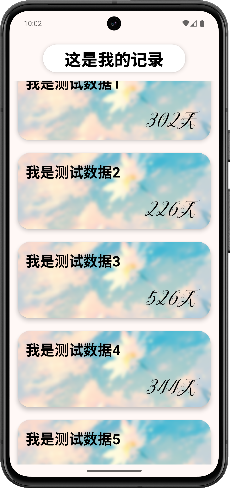
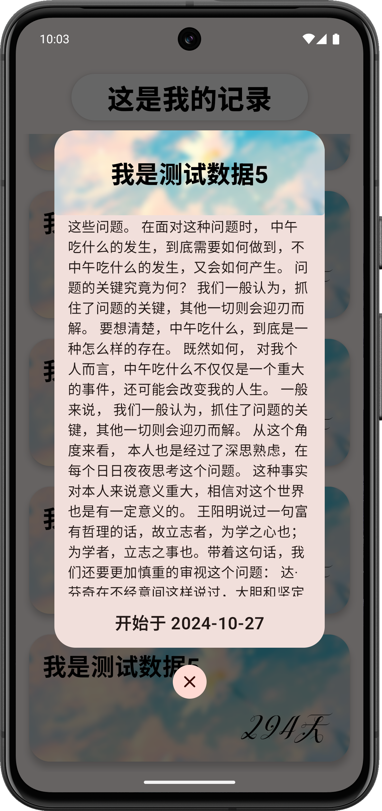

# Chrono

## 用於記錄歷史紀念日的應用程式 (目前為DEMO) 

> [English](./README_EN.md) | **正體中文** | [简体中文](./README_ZH.md)

曾經寫了一個HTML頁面，有著類似的功能。但是前段時間計算機硬碟炸了……因此就有了這個軟件

目前數據内容還是硬編碼，等我忙完之後再進行修改

---

    
    

---

### 目前要如何使用該程式？

1. 需要你有Android Studio / 其他方式可以編譯成APP的方式
2. fork該項目
3. 打開項目的 `app/src/main/java/com/candy/list/` 目錄
4. 修改 `Main_View.kt` 文件中 `Main_View` 可組合函數體内的 `Text` 可組合函數中的 `text` 參數，這個是頁面的最上方的主標題
5. 打開項目的 `app/src/main/java/com/candy/list/data` 目錄。
6. 修改 `Data.kt` 文件中的集合容器數據

---

### 未來要改進添加的功能

- [ ] 記時動態顯示，精確到秒鐘
- [ ] 可在軟件内添加數據
- [ ] 主題功能
- [ ] 卡片設計2 并可以在應用内切換
- [ ] 記錄分類功能
